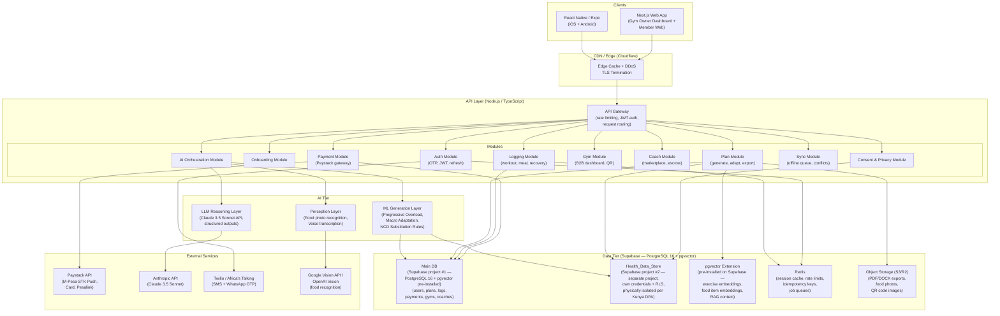
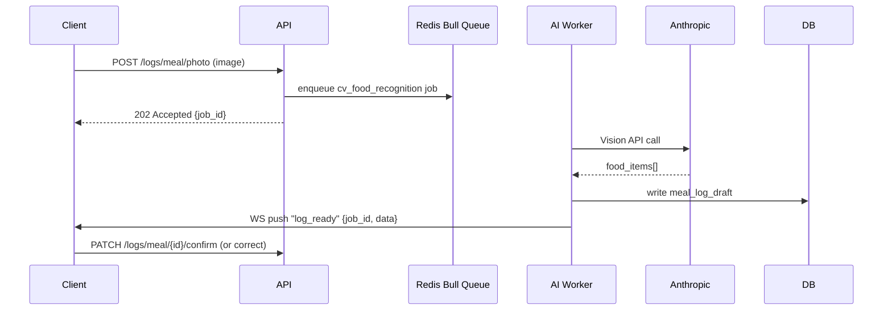
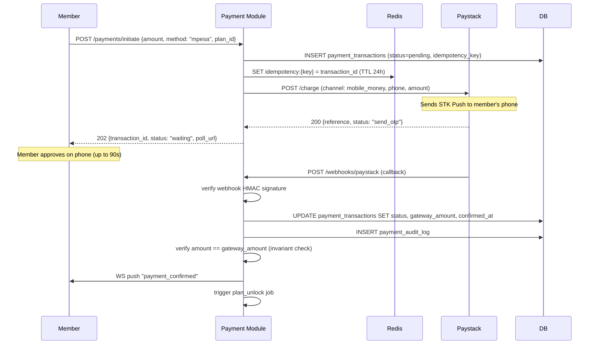
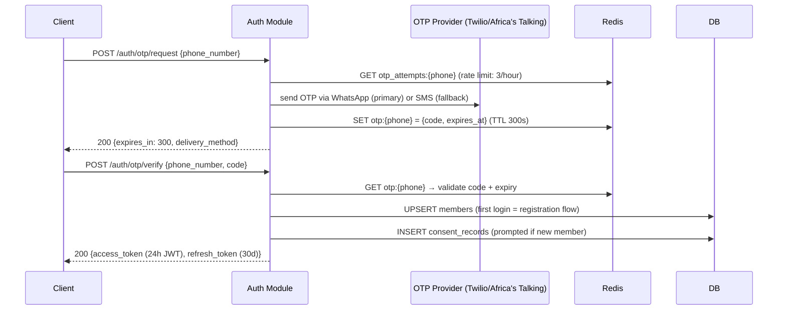
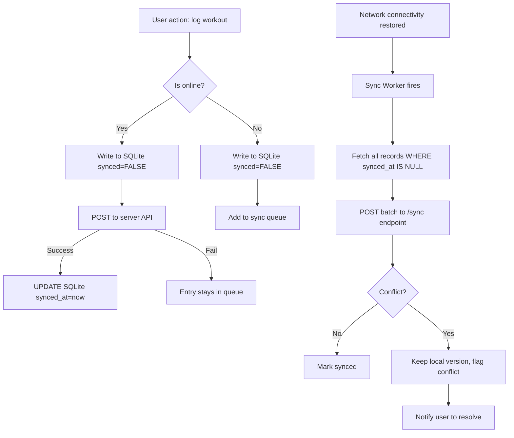
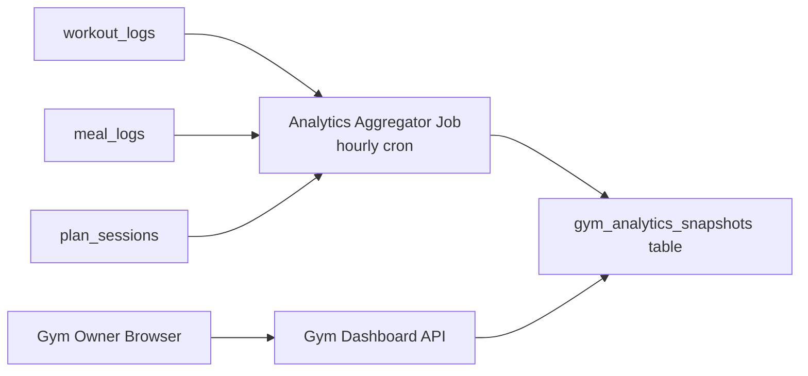
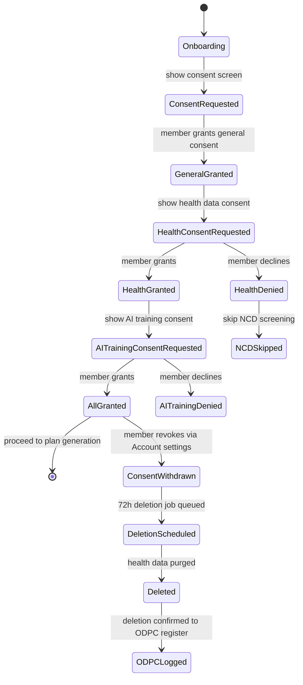
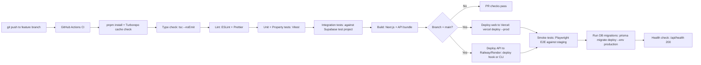

# PHYZIQ Platform — Technical Design

## Overview

PHYZIQ is an AI-powered adaptive fitness platform targeting gym members in Nairobi, Kenya, with a global-architecture foundation. The platform combines four tightly integrated products: an adaptive AI coaching loop, a gym-partner B2B analytics layer, a human coach marketplace, and a **product marketplace** — all under a single M-Pesa-native, offline-first, Kenya-DPA-compliant product.

The **product marketplace** extends the platform beyond coaching into commerce. Members can browse and purchase: supplement products (protein, vitamins, pre-workout), gym apparel and outfits, and gym equipment (dumbbells, resistance bands, benches, etc.). Products are fulfilled by third-party sellers; PHYZIQ takes a commission on each sale. The same M-Pesa payment rail used for subscriptions and coach bookings powers product purchases. The product marketplace is separate from the coach marketplace — coaches are a service, products are physical goods.

### Core Design Principles

- **Adaptive over static**: Every plan artifact regenerates in response to real-world signals (missed sessions, recovery scores, logged performance). The system treats the plan as a live document, not a PDF.
- **Transparent confidence**: Every AI-generated output carries a `Confidence_Indicator`. The system never presents AI estimates as facts.
- **Offline-first on 3G**: The mobile client functions fully without connectivity. Sync is background, conflict resolution is local-wins.
- **Health data isolation**: NCD profile data lives in a physically separate database partition (`health_data_store`) with its own access control layer, audit logging, and encryption key hierarchy — not merely a separate table in the main database.
- **Kenya-first economics**: M-Pesa STK Push is the primary payment rail, not a secondary option. Pricing is fixed in KES. The 12% flat commission replaces tiered fee ladders.

### Tagline
*"Built for how you actually live."*

---

## Architecture

### System Style: Modular Monolith with Domain Services

PHYZIQ uses a **modular monolith** for the backend at MVP, structured into bounded-context modules that can be extracted to microservices as load demands. The alternative (microservices from day one) would add operational overhead that is premature given an MVP team and the complexity of the AI orchestration layer.

The web frontend is **Next.js 14 (App Router)**. The mobile client is **React Native with Expo (SDK 52)**. Both share a `packages/shared` TypeScript package for types, API clients, and utility logic. The backend is **Node.js with TypeScript**, deployed as a single application process with internal module boundaries enforced by import rules.


### High-Level Architecture Diagram




### Monorepo Structure

```
phyziq/
├── apps/
│   ├── web/                    # Next.js 14 — member web + gym owner dashboard → deployed to Vercel
│   ├── mobile/                 # React Native / Expo
│   └── api/                    # Node.js / TypeScript backend → deployed to Railway/Render
├── packages/
│   ├── shared/                 # Types, API client, constants (no platform deps)
│   ├── ui/                     # Shared React component library (NativeWind)
│   └── ai-engine/              # AI orchestration logic (importable in api/)
├── infra/                      # Vercel config (vercel.json), Railway/Render deployment config,
│                               # environment variable templates (.env.example)
└── turbo.json                  # Turborepo build pipeline
```

Tooling: **pnpm workspaces + Turborepo** for build caching and task orchestration. `packages/shared` is the single source of truth for API response types, preventing drift between web, mobile, and backend.

Deployment targets:
- `apps/web` → **Vercel** (zero-config Next.js 14 deploy; preview deployments on every PR)
- `apps/api` → **Railway or Render** (long-running Node.js process; supports WebSockets and Redis job queues; not compatible with Vercel serverless)

---

## Three-Layer AI Orchestration

### Layer 1: ML Generation Layer (Deterministic Rules Engine)

The ML layer handles computationally cheap, rules-based operations that need sub-second response times and can run without LLM inference costs:

- **Progressive Overload Engine**: Reads the last N sessions for an exercise, computes a load recommendation using a linear periodisation algorithm seeded from the member's fitness level. Outputs: `{ exercise_id, recommended_weight_kg, recommended_reps, recommended_sets, confidence: number }`.
- **NCD Substitution Engine**: Applies a deterministic rule table mapping `(food_item_id, ncd_risk_type)` → `substitute_food_item_id`. Rules are maintained in the `ncd_substitution_rules` table, editable by qualified dietitians without a code deploy.
- **Macro Adaptation Engine**: Reads 7-day weight log trends and adjusts TDEE (Total Daily Energy Expenditure) targets using an exponential moving average, following the same methodology as adaptive energy expenditure models in sports science literature.
- **Volume Redistribution Engine**: When a session is missed, computes how to spread the missed volume across remaining sessions in the week without violating recovery constraints.

### Layer 2: LLM Reasoning Layer (Claude 3.5 Sonnet)

The LLM layer handles tasks requiring natural language understanding, contextual reasoning, and plan narrative generation. All calls use Claude's **structured outputs** feature with a JSON schema to ensure machine-parseable responses.

Key responsibilities:
- **Plan narrative generation**: Converts ML-generated workout/nutrition data into human-readable plan descriptions.
- **Conversational AI Coach**: Maintains a sliding 5-message context window. Each API call includes the member's current `Adaptive_Plan` summary as a system-injected context block (not user-visible).
- **Exercise swap rationale**: Given a requested swap, generates the one-sentence biomechanical rationale.
- **Exception plan generation**: When a member describes a travel scenario, generates a modified plan variant.
- **Confidence estimation**: The LLM assigns confidence scores to its own outputs, which are passed through as `Confidence_Indicator` values.

LLM calls are always async — they write to a job queue (Redis Bull) and the client polls via WebSocket or SSE for the result. This prevents HTTP timeouts on slow inference.

```
LLM Request Pipeline:
  Client request → API Gateway → AI_Orchestration Module
    → enqueue LLM job (Redis Bull) → return job_id to client
    → LLM Worker (separate process) → calls Anthropic API
    → writes structured result to main DB
    → pushes "job_complete" event via WebSocket
    → Client receives result
```

### Layer 3: Computer Vision / Perception Layer

Handles food photo recognition and voice transcription:

- **Food photo recognition**: Image is uploaded to S3, a pre-signed URL is passed to Google Vision API (food label detection + object detection). Results are enriched by fuzzy-matching identified labels against the `food_items` table using pgvector cosine similarity on food name embeddings.
- **Voice transcription**: Audio clip uploaded to S3, transcribed via Whisper API (or OpenAI Audio API). Transcription text is then processed by the LLM layer to extract food items and quantities.

Both CV operations follow the same async job queue pattern as LLM calls.




---

## Components and Interfaces

### Information Architecture (Navigation Model)

The navigation structure, confirmed by the dashboard HTML, maps to six top-level domains:

```
Top Nav: Today | Plans | Coach | Marketplace | Progress | Account

Today
├── Greeting + adaptation context ("plan shifted after Wednesday's missed session")
├── Today's Plan Card
│   ├── Workout card (with Adjusted badge if rescheduled)
│   ├── Meal card (with NCD-aware labels)
│   └── Recovery card
├── Confidence chips: High confidence | Estimated | Confirmed
├── Recent logs (photo-logged + manually-logged entries)
├── Weekly summary: "4/5 Sessions · 2 Adjusted"
├── AI Coach message (weekly summary from LLM)
└── Gym schedule integration panel (upcoming classes)

Plans
├── Current Adaptive_Plan (full view)
├── Week navigator (day pills Mon–Sun with visual states)
├── Plan history
└── Export / Download (locked in Free_Preview)

Coach
└── Conversational AI Coach (chat interface)

Marketplace
├── Browse coaches (filter by specialty, rating, price)
├── Coach profile
├── Booking flow (calendar + payment)
└── My bookings / session history

Progress
├── Weight trend chart
├── Performance logs per exercise
├── Macro compliance chart
└── Weekly volume tracker

Account
├── Profile (demographics, NCD profile link)
├── Subscription / payment management
├── Consent management (three-category toggles)
├── Transaction history
├── Notification preferences
└── Data export / deletion request
```

### Key UI Components

#### Today View — `<TodayDashboard />`
Renders the member's daily snapshot. Receives a `DayPlan` object and a `SyncStatus` enum. When `SyncStatus.OFFLINE`, renders an amber banner with "Offline — logged data will sync when connected." The greeting string is computed server-side: `{timeOfDay}, {firstName} / {dayOfWeek} — {adaptationContext}`.

#### Confidence Chip — `<ConfidenceChip confidence={number} source="ai"|"confirmed"|"manual" />`
Three visual states: `high` (≥80%, green), `estimated` (40–79%, blue), `low` (<40%, amber). Maps to the "High confidence / Estimated / Confirmed" chips seen in the HTML. The `confirmed` state is shown when the member has explicitly verified an AI estimate via the Correction_Flow.

#### Weekly Day Pills — `<WeekNavigator week={WeekPlan} />`
Seven pill buttons (Mon–Sun). Each pill carries a `DayStatus`: `completed` (green fill), `scheduled` (outline), `missed` (red fill + strikethrough), `rebuilt` (amber fill + ↻ icon), `rest` (grey). The "Adjusted" amber badge on the today card maps to a `rebuilt` day status.

#### Correction Flow — `<CorrectionSheet entry={LogEntry} onSubmit={fn} />`
Bottom sheet (mobile) or side panel (web). Pre-populates all fields from the AI estimate. Submitting calls `PATCH /logs/{type}/{id}` with the corrected values. On success, the entry's `confidence_source` flips to `"confirmed"` and the Confidence Chip updates.

#### Gym Schedule Panel — `<GymSchedulePanel gymId={string} />`
Shown on Today view when member has a linked gym. Fetches upcoming classes from the gym's schedule (provided by Gym_Owner via the B2B dashboard). Read-only from member perspective.

#### Free_Preview Gate — `<PlanPreviewGate isPaid={boolean} />`
Wraps export actions. When `isPaid=false`, intercepts download clicks and renders `<PaywallModal />` with both pricing options (KES 450 one-time / KES 1,200/month) and all fees disclosed upfront.

#### M-Pesa Payment Sheet — `<MpesaPaymentSheet amount={number} phone={string} />`
Initiates STK Push on mount. Shows three states: `waiting` (spinner + "Check your phone for the M-Pesa prompt"), `success` (green checkmark), `failed` (error message + retry CTA). Polls `/payments/{transactionId}/status` every 5 seconds up to 90 seconds before showing timeout state.


---

## Data Models

### Main Database Schema (PostgreSQL 16)

```sql
-- Members
CREATE TABLE members (
    id              UUID PRIMARY KEY DEFAULT gen_random_uuid(),
    phone_number    TEXT UNIQUE NOT NULL,           -- E.164 format
    first_name      TEXT NOT NULL,
    last_name       TEXT NOT NULL,
    date_of_birth   DATE NOT NULL,
    sex             TEXT CHECK (sex IN ('male','female','other','prefer_not_to_say')),
    height_cm       NUMERIC(5,1) CHECK (height_cm BETWEEN 50 AND 300),
    weight_kg       NUMERIC(5,1) CHECK (weight_kg BETWEEN 20 AND 500),
    fitness_goal    TEXT NOT NULL,
    activity_level  TEXT NOT NULL,
    gym_id          UUID REFERENCES gym_partners(id),
    subscription_status TEXT DEFAULT 'free_preview',
    created_at      TIMESTAMPTZ DEFAULT NOW(),
    updated_at      TIMESTAMPTZ DEFAULT NOW()
);

-- Gym Partners
CREATE TABLE gym_partners (
    id              UUID PRIMARY KEY DEFAULT gen_random_uuid(),
    name            TEXT NOT NULL,
    location        TEXT NOT NULL,
    city            TEXT NOT NULL,
    qr_code_token   TEXT UNIQUE NOT NULL,           -- decoded from QR scan
    equipment_list  JSONB NOT NULL DEFAULT '[]',   -- array of equipment slugs
    owner_id        UUID REFERENCES gym_owners(id),
    is_active       BOOLEAN DEFAULT TRUE,
    created_at      TIMESTAMPTZ DEFAULT NOW()
);

-- Gym Owners (B2B accounts)
CREATE TABLE gym_owners (
    id              UUID PRIMARY KEY DEFAULT gen_random_uuid(),
    phone_number    TEXT UNIQUE NOT NULL,
    email           TEXT UNIQUE NOT NULL,
    business_name   TEXT NOT NULL,
    created_at      TIMESTAMPTZ DEFAULT NOW()
);

-- Adaptive Plans
CREATE TABLE adaptive_plans (
    id              UUID PRIMARY KEY DEFAULT gen_random_uuid(),
    member_id       UUID NOT NULL REFERENCES members(id),
    plan_type       TEXT CHECK (plan_type IN ('workout','nutrition','combined')),
    status          TEXT DEFAULT 'active',          -- active, superseded, archived
    is_paid         BOOLEAN DEFAULT FALSE,
    week_number     INT NOT NULL,
    generated_at    TIMESTAMPTZ DEFAULT NOW(),
    last_adapted_at TIMESTAMPTZ,
    plan_data       JSONB NOT NULL,                 -- full plan structure
    confidence_avg  NUMERIC(4,1),
    version         INT DEFAULT 1
);

-- Plan Sessions (individual workout sessions within a plan)
CREATE TABLE plan_sessions (
    id              UUID PRIMARY KEY DEFAULT gen_random_uuid(),
    plan_id         UUID NOT NULL REFERENCES adaptive_plans(id),
    member_id       UUID NOT NULL REFERENCES members(id),
    scheduled_date  DATE NOT NULL,
    session_type    TEXT NOT NULL,                  -- workout, rest, recovery
    status          TEXT DEFAULT 'scheduled',       -- scheduled, completed, missed, rebuilt
    session_data    JSONB NOT NULL,                 -- exercises, sets, reps, etc.
    adaptation_note TEXT                            -- why this session was modified
);

-- Workout Logs
CREATE TABLE workout_logs (
    id              UUID PRIMARY KEY DEFAULT gen_random_uuid(),
    member_id       UUID NOT NULL REFERENCES members(id),
    session_id      UUID REFERENCES plan_sessions(id),
    exercise_id     UUID REFERENCES exercises(id),
    logged_at       TIMESTAMPTZ DEFAULT NOW(),
    sets            JSONB NOT NULL,                 -- [{set_number, weight_kg, reps, duration_s}]
    recovery_score  INT CHECK (recovery_score BETWEEN 1 AND 10),
    synced          BOOLEAN DEFAULT TRUE,           -- FALSE when written offline
    offline_id      TEXT                            -- client-side ID for dedup
);

-- Meal Logs
CREATE TABLE meal_logs (
    id              UUID PRIMARY KEY DEFAULT gen_random_uuid(),
    member_id       UUID NOT NULL REFERENCES members(id),
    logged_at       TIMESTAMPTZ DEFAULT NOW(),
    meal_type       TEXT,                           -- breakfast, lunch, dinner, snack
    food_items      JSONB NOT NULL,                 -- [{food_item_id, name, quantity_g, macros, confidence}]
    log_source      TEXT DEFAULT 'manual',          -- manual, photo, voice
    photo_url       TEXT,                           -- S3 URL if photo-logged
    confidence_avg  NUMERIC(4,1),
    corrections     JSONB,                          -- original AI estimate before correction
    synced          BOOLEAN DEFAULT TRUE,
    offline_id      TEXT
);

-- Food Items (with pgvector embedding for similarity search)
CREATE TABLE food_items (
    id              UUID PRIMARY KEY DEFAULT gen_random_uuid(),
    name            TEXT NOT NULL,
    name_swahili    TEXT,
    calories_per_100g NUMERIC(6,1),
    protein_g       NUMERIC(5,1),
    carbs_g         NUMERIC(5,1),
    fat_g           NUMERIC(5,1),
    fibre_g         NUMERIC(5,1),
    glycaemic_index INT,
    sodium_mg       NUMERIC(7,1),
    is_local_kenyan BOOLEAN DEFAULT FALSE,
    embedding       VECTOR(1536)                    -- OpenAI text-embedding-3-small
);
CREATE INDEX ON food_items USING hnsw (embedding vector_cosine_ops);

-- Exercises (with pgvector embedding for swap similarity search)
CREATE TABLE exercises (
    id              UUID PRIMARY KEY DEFAULT gen_random_uuid(),
    name            TEXT NOT NULL,
    muscle_groups   TEXT[] NOT NULL,
    equipment_required TEXT[],
    movement_pattern TEXT,                          -- push, pull, hinge, squat, carry
    embedding       VECTOR(1536)                    -- for biomechanically similar swap search
);
CREATE INDEX ON exercises USING hnsw (embedding vector_cosine_ops);

-- Payments
CREATE TABLE payment_transactions (
    id              UUID PRIMARY KEY DEFAULT gen_random_uuid(),
    member_id       UUID REFERENCES members(id),
    coach_id        UUID REFERENCES coaches(id),
    amount_kes      NUMERIC(10,2) NOT NULL,
    currency        TEXT DEFAULT 'KES',
    payment_method  TEXT NOT NULL,                  -- mpesa, card, pesalink
    payment_rail    TEXT NOT NULL,                  -- paystack, stripe
    status          TEXT DEFAULT 'pending',         -- pending, success, failed, refunded
    idempotency_key TEXT UNIQUE NOT NULL,
    gateway_ref     TEXT,                           -- Paystack/Stripe reference
    gateway_amount  NUMERIC(10,2),                  -- amount confirmed by gateway callback
    initiated_at    TIMESTAMPTZ DEFAULT NOW(),
    confirmed_at    TIMESTAMPTZ,
    plan_id         UUID REFERENCES adaptive_plans(id),
    transaction_type TEXT NOT NULL                  -- one_time_plan, subscription, coach_booking
);

-- Payment Audit Log (append-only, no updates)
CREATE TABLE payment_audit_log (
    id              BIGSERIAL PRIMARY KEY,
    transaction_id  UUID NOT NULL,
    event_type      TEXT NOT NULL,                  -- initiated, callback_received, status_update
    event_data      JSONB NOT NULL,
    gateway_ref     TEXT,
    utc_timestamp   TIMESTAMPTZ DEFAULT NOW(),
    CONSTRAINT no_update CHECK (TRUE)              -- enforced at app layer: INSERT only
);

-- Coaches
CREATE TABLE coaches (
    id              UUID PRIMARY KEY DEFAULT gen_random_uuid(),
    member_id       UUID REFERENCES members(id),    -- coaches are also members
    specialisation  TEXT[],                         -- personal_training, dietetics, physiotherapy
    credentials     JSONB,
    is_verified     BOOLEAN DEFAULT FALSE,
    verification_doc_url TEXT,
    rating_avg      NUMERIC(3,1),
    session_fee_kes NUMERIC(8,2),
    cancellation_policy JSONB,                      -- {policy_type, refund_pct, hours_threshold}
    created_at      TIMESTAMPTZ DEFAULT NOW()
);

-- Coach Bookings
CREATE TABLE coach_bookings (
    id              UUID PRIMARY KEY DEFAULT gen_random_uuid(),
    member_id       UUID NOT NULL REFERENCES members(id),
    coach_id        UUID NOT NULL REFERENCES coaches(id),
    scheduled_at    TIMESTAMPTZ NOT NULL,
    status          TEXT DEFAULT 'pending',         -- pending, confirmed, completed, cancelled
    session_fee_kes NUMERIC(8,2) NOT NULL,
    commission_pct  NUMERIC(4,2) NOT NULL CHECK (commission_pct BETWEEN 10 AND 15),
    escrow_released BOOLEAN DEFAULT FALSE,
    payment_id      UUID REFERENCES payment_transactions(id),
    cancellation_at TIMESTAMPTZ,
    review_submitted BOOLEAN DEFAULT FALSE
);

-- Consent Records
CREATE TABLE consent_records (
    id              UUID PRIMARY KEY DEFAULT gen_random_uuid(),
    member_id       UUID NOT NULL REFERENCES members(id),
    consent_type    TEXT NOT NULL CHECK (consent_type IN ('general', 'health_data', 'ai_training')),
    granted         BOOLEAN NOT NULL,
    granted_at      TIMESTAMPTZ DEFAULT NOW(),
    revoked_at      TIMESTAMPTZ,
    ip_address      INET,
    user_agent      TEXT
);

-- Plan Export Files
CREATE TABLE plan_exports (
    id              UUID PRIMARY KEY DEFAULT gen_random_uuid(),
    plan_id         UUID NOT NULL REFERENCES adaptive_plans(id),
    member_id       UUID NOT NULL REFERENCES members(id),
    format          TEXT NOT NULL CHECK (format IN ('pdf', 'docx')),
    s3_key          TEXT NOT NULL,
    file_size_bytes INT,
    generated_at    TIMESTAMPTZ DEFAULT NOW(),
    expires_at      TIMESTAMPTZ DEFAULT NOW() + INTERVAL '90 days',
    is_valid        BOOLEAN DEFAULT TRUE            -- set FALSE when plan is updated
);

-- Gym Challenges
CREATE TABLE gym_challenges (
    id              UUID PRIMARY KEY DEFAULT gen_random_uuid(),
    gym_id          UUID NOT NULL REFERENCES gym_partners(id),
    name            TEXT NOT NULL,
    target_metric   TEXT NOT NULL,
    start_date      DATE NOT NULL,
    end_date        DATE NOT NULL,
    created_at      TIMESTAMPTZ DEFAULT NOW()
);

-- Challenge Enrolments
CREATE TABLE challenge_enrolments (
    challenge_id    UUID NOT NULL REFERENCES gym_challenges(id),
    member_id       UUID NOT NULL REFERENCES members(id),
    consented       BOOLEAN NOT NULL,
    enrolled_at     TIMESTAMPTZ DEFAULT NOW(),
    PRIMARY KEY (challenge_id, member_id)
);
```


### Health_Data_Store Schema (Isolated Partition)

The Health_Data_Store is a **separate PostgreSQL database instance** (not just a schema), with its own connection credentials, its own AES-256 encryption key (distinct from the main database key), and network-level access restrictions allowing connections only from the `ai-engine` and `consent-module` service accounts.

```sql
-- NCD Profiles (Health_Data_Store — separate DB instance)
CREATE TABLE ncd_profiles (
    id              UUID PRIMARY KEY DEFAULT gen_random_uuid(),
    member_id       UUID UNIQUE NOT NULL,           -- FK is logical only; no cross-DB constraint
    diabetes_risk   TEXT,                           -- low, moderate, high, diagnosed
    hypertension_risk TEXT,
    cardiovascular_risk TEXT,
    medications     JSONB,                          -- encrypted at column level
    last_updated    TIMESTAMPTZ DEFAULT NOW(),
    screening_version INT DEFAULT 1
);

-- Biometric Logs (Health_Data_Store)
CREATE TABLE biometric_logs (
    id              UUID PRIMARY KEY DEFAULT gen_random_uuid(),
    member_id       UUID NOT NULL,
    logged_at       TIMESTAMPTZ DEFAULT NOW(),
    weight_kg       NUMERIC(5,1),
    body_fat_pct    NUMERIC(4,1),
    resting_hr      INT,
    blood_pressure_systolic  INT,
    blood_pressure_diastolic INT,
    notes           TEXT
);

-- Health_Data_Store Access Audit Log
CREATE TABLE health_data_access_log (
    id              BIGSERIAL PRIMARY KEY,
    accessed_at     TIMESTAMPTZ DEFAULT NOW(),
    member_id       UUID NOT NULL,
    accessing_service TEXT NOT NULL,               -- ai-engine, consent-module
    operation_type  TEXT NOT NULL,                 -- READ, WRITE, DELETE
    request_context TEXT                           -- job_id or session_id for traceability
);
```

**Access policy**: All queries to the Health_Data_Store must go through the `HealthDataRepository` class in the `consent` module. Direct SQL access by non-approved services is prevented by PostgreSQL role-based access control: only the `health_data_svc` role (assigned to `ai-engine` and `consent-module` services) has `CONNECT` privilege on the health DB.

---

### Database Infrastructure (Supabase)

**Main Database** — Supabase project #1
- PostgreSQL 16 with pgvector pre-installed (no manual `CREATE EXTENSION` needed)
- Connection via Supabase connection pooler URL (PgBouncer, transaction mode) for API at runtime; direct URL for Prisma migrations
- Environment variables:
  - `DATABASE_URL` — pooler URL used by Prisma at runtime (already set in `apps/api/.env`)
  - `DIRECT_URL` — direct connection URL used by `prisma migrate deploy` and `prisma db push`
- Migrations managed via Prisma: `prisma migrate deploy` runs against `DIRECT_URL` during CI/CD
- Row Level Security (RLS) disabled on tables accessed only by the service role (API uses `service_role` key, not `anon`)

**Health_Data_Store** — Supabase project #2 (separate project, separate credentials)
- Physically isolated from main DB: different project, different connection string, different API keys — satisfies the Kenya DPA physical isolation requirement (Req 1.7, 11.2)
- The `health_data_svc` PostgreSQL role requirement is satisfied by using the Supabase `service_role` of project #2 exclusively for health data operations — no other service has this key
- `HealthDataRepository` class connects using `HEALTH_DB_URL` (project #2 direct URL)
- Environment variables:
  - `HEALTH_DB_URL` — direct connection URL for Supabase project #2
- Migrations applied separately: `prisma migrate deploy --schema=prisma/health-schema.prisma` against `HEALTH_DB_URL`, or via Supabase SQL editor for the health project

**pgvector**: Pre-installed on all Supabase projects. The HNSW index creation (`CREATE INDEX USING hnsw`) works without additional setup — no manual `CREATE EXTENSION vector` step required.

**Prisma dual-URL configuration** (required for Supabase connection pooling):
```prisma
// prisma/schema.prisma
datasource db {
  provider  = "postgresql"
  url       = env("DATABASE_URL")   // PgBouncer pooler URL
  directUrl = env("DIRECT_URL")     // Direct connection for migrations
}
```

### Offline Cache Schema (SQLite via Expo SQLite)

The mobile client uses **Expo SQLite** for offline storage. Schema mirrors the server models with two additional columns: `synced_at` (null when pending sync) and `offline_id` (UUID generated client-side for dedup).

```sql
-- Local offline tables (SQLite)
CREATE TABLE offline_workout_logs (
    offline_id TEXT PRIMARY KEY,
    server_id TEXT,
    member_id TEXT NOT NULL,
    log_data TEXT NOT NULL,     -- JSON blob
    logged_at TEXT NOT NULL,
    synced_at TEXT              -- NULL = pending sync
);

CREATE TABLE offline_meal_logs (
    offline_id TEXT PRIMARY KEY,
    server_id TEXT,
    member_id TEXT NOT NULL,
    log_data TEXT NOT NULL,
    logged_at TEXT NOT NULL,
    synced_at TEXT
);

CREATE TABLE cached_plans (
    plan_id TEXT PRIMARY KEY,
    member_id TEXT NOT NULL,
    plan_data TEXT NOT NULL,    -- JSON blob
    cached_at TEXT NOT NULL,
    week_number INT
);
-- Eviction: DELETE FROM cached_plans WHERE cached_at < datetime('now', '-30 days')
```


---

## Payment Architecture

### Paystack Integration (M-Pesa STK Push)

The `PaymentModule` is the single gateway to all payment operations. No other module calls external payment APIs directly.



**Idempotency**: Before initiating any Paystack call, the module checks `Redis.GET idempotency:{key}`. If the key exists and the transaction is already `success`, return the existing transaction. This prevents duplicate STK pushes if the client retries.

**Retry logic**: On Paystack 5xx responses, the module retries with exponential backoff: 1s, then 2s, then fails. After two retries, the transaction is marked `failed` and the error is logged.

**Webhook security**: All Paystack webhooks are verified against `X-Paystack-Signature` HMAC-SHA512. Invalid signatures are rejected with HTTP 401, logged, and alerted.

**Timeout handling**: A Redis delayed job is scheduled at `T+90s` for every pending STK Push. If the transaction is still `pending` when the job fires, it is marked `timed_out` (a substate of `failed`) and the member is notified. No charge is made.

### Multi-Rail Routing

The `PaymentModule` exports a single `initiatePayment(params: PaymentParams)` function. Internally, it routes to the correct gateway based on `params.method` and `params.member_country`:

```typescript
const PAYMENT_ROUTERS = {
  mpesa: PaystackMpesaRouter,
  card_ke: PaystackCardRouter,
  pesalink: PaystackPesalinkRouter,
  card_intl: StripeConnectRouter,
};
```

Adding a new payment method requires adding a new router class implementing the `PaymentRouter` interface — no changes to the `initiatePayment` function.

### Marketplace Escrow and Commission

For coach bookings, payment flow has an additional escrow step:

1. Member pays session fee → held in Paystack escrow (sub-account).
2. At `session_scheduled_at + session_duration + buffer`, a cron job checks `coach_bookings` for completed sessions where `escrow_released = FALSE`.
3. Commission deducted (between 10–15% per booking, stored in `commission_pct` column).
4. Net amount transferred to Coach's linked Paystack sub-account via Transfers API.
5. `escrow_released = TRUE`, coach notified.

For cancellations >24h before session: full refund via Paystack refund API, no coach transfer.
For cancellations ≤24h: partial refund per `coach.cancellation_policy.refund_pct`.

---

## Auth Flow

### OTP-Based Authentication



**OTP delivery priority**: WhatsApp first (higher open rate in Kenya), fall back to SMS if WhatsApp delivery fails within 30s. Third fallback for the second retry attempt: voice call OTP.

**JWT structure**:
```json
{
  "sub": "member_uuid",
  "role": "member" | "gym_owner" | "coach",
  "gym_id": "uuid_or_null",
  "iat": 1700000000,
  "exp": 1700086400
}
```

**Refresh flow**: `POST /auth/refresh` with the refresh token (sent in `HttpOnly` cookie) issues a new access token. Refresh tokens are stored in Redis with the ability to revoke all sessions by deleting the member's refresh key prefix.

**Gym owner sessions**: Max 8 hours (enforced by JWT `exp`). No refresh — re-authenticate required after expiry.

---

## Offline-First Data Model

### Sync Architecture

The mobile client uses a **sync queue** pattern. Every write operation (workout log, meal log) is first written to the local SQLite database with `synced_at = NULL`, then the app attempts an immediate sync if online. If offline, a background sync worker runs when connectivity is detected.



**Conflict resolution**: A conflict is detected when `POST /sync` returns a `409 Conflict` response, indicating the server-side record was modified after the client's last sync. The `local_wins` strategy is applied: the server replaces its record with the client version and sets a `has_conflict` flag for the member to review.

**Cache eviction**: A nightly local job deletes SQLite records where `logged_at < NOW() - 30 days`. Cached plan data is evicted when a newer plan version is synced.

**Compression**: All API responses from `/sync` and `/plans` endpoints are gzip-compressed at the Node.js layer (`compression` middleware). Responses >10KB trigger Brotli encoding. The mobile client detects throughput via the `NetInfo` Expo API; when below 256kbps, image URLs in plan responses are replaced with low-resolution variants (served from the CDN at `/img/thumb/`).

---

## API Design

### REST Endpoints

All endpoints are prefixed with `/api/v1`. Authentication via `Authorization: Bearer {jwt}` header on all protected routes.

```
Auth
  POST   /auth/otp/request           Request OTP delivery
  POST   /auth/otp/verify            Verify OTP, issue tokens
  POST   /auth/refresh               Issue new access token
  POST   /auth/logout                Revoke refresh token

Onboarding
  POST   /onboarding/qr-context      Decode QR token, return gym pre-fill data
  POST   /onboarding/register        Submit registration form
  POST   /onboarding/ncd-screening   Submit NCD questionnaire
  GET    /onboarding/preview-plan    Fetch Free_Preview plan

Members
  GET    /members/me                 Get own profile
  PATCH  /members/me                 Update profile
  GET    /members/me/consent         Get consent status
  POST   /members/me/consent         Update consent

Plans
  GET    /plans/current              Get active Adaptive_Plan
  GET    /plans/{id}                 Get specific plan
  POST   /plans/adapt                Trigger manual plan adaptation
  GET    /plans/{id}/export/{format} Download PDF or DOCX (paid only)

Logging
  POST   /logs/workout               Log workout set
  POST   /logs/meal                  Log meal (manual)
  POST   /logs/meal/photo            Upload meal photo (returns job_id)
  POST   /logs/meal/voice            Upload voice clip (returns job_id)
  PATCH  /logs/meal/{id}             Apply correction
  GET    /logs/jobs/{job_id}         Poll AI job status
  POST   /sync                       Batch sync offline queue

Payments
  POST   /payments/initiate          Initiate payment (STK Push or card)
  GET    /payments/{id}/status       Poll payment status
  GET    /payments/history           Get transaction history
  POST   /webhooks/paystack          Paystack callback (no auth, HMAC verified)

Coach / Marketplace
  GET    /coaches                    List coaches (filter, paginate)
  GET    /coaches/{id}               Coach profile
  POST   /bookings                   Book a session
  GET    /bookings/mine              Member's bookings
  POST   /bookings/{id}/cancel       Cancel booking
  POST   /bookings/{id}/review       Submit rating + review

AI Coach
  POST   /coach/chat                 Send message to conversational coach
  GET    /coach/chat/history         Get last 5 messages

Gym Owner
  GET    /gym/dashboard              Cohort analytics
  GET    /gym/qr-code                Download QR code PNG/PDF
  POST   /gym/challenges             Create cohort challenge
  GET    /gym/challenges/{id}/leaderboard
  POST   /gym/reports/monthly        Request monthly PDF report

Health Data (restricted — requires health_data consent)
  GET    /health/ncd-profile         Get own NCD profile
  PUT    /health/ncd-profile         Update NCD profile
  POST   /health/biometrics          Log biometric data
  DELETE /health/all                 Delete all health data (consent withdrawal)
```


---

## Gym-Owner Dashboard Data Model and Analytics Pipeline

### Data Architecture

The Gym Dashboard does not query the main `members` table directly. Instead, it reads from a **pre-aggregated analytics layer** to avoid OLTP query pressure and guarantee the privacy constraint (Requirement 7.8: no individual health data exposed).



The `gym_analytics_snapshots` table stores pre-computed aggregate rows per gym per hour:

```sql
CREATE TABLE gym_analytics_snapshots (
    id              UUID PRIMARY KEY DEFAULT gen_random_uuid(),
    gym_id          UUID NOT NULL REFERENCES gym_partners(id),
    snapshot_at     TIMESTAMPTZ NOT NULL,
    total_active_members INT,
    avg_plan_completion_pct NUMERIC(5,2),
    avg_weekly_sessions NUMERIC(5,2),
    top_exercises   JSONB,                          -- [{exercise_name, count}] top 5
    session_heatmap JSONB,                          -- {day: {hour: count}} aggregate
    at_risk_member_count INT,                       -- members with 7+ days no activity
    at_risk_member_ids UUID[]                       -- IDs only, no personal data
);
```

The `at_risk_member_ids` array is used to render the "at risk" count in the dashboard. When the Gym Owner clicks "view at-risk members", the UI shows anonymised placeholders (e.g., "Member #1247") — names are not exposed in the dashboard.

### Monthly Report Generation

Gym Owner clicks "Request monthly report" → `POST /gym/reports/monthly` → enqueues a Bull job → the worker queries `gym_analytics_snapshots` for the requested month range → renders a Handlebars HTML template → Puppeteer generates PDF → S3 upload → email delivered via SendGrid with pre-signed S3 URL (TTL 48h).

---

## Plan Export System

### PDF and DOCX Generation

Export jobs are queued in Redis Bull and processed by a dedicated export worker:

1. Worker fetches the full `adaptive_plans.plan_data` JSON.
2. **DOCX**: Built using the [`docx`](https://www.npmjs.com/package/docx) npm library. Plan data is mapped to `docx` section objects: heading styles for week/day, table objects for workout sets, paragraph objects for meals with macro breakdowns. PHYZIQ brand header/footer applied via `Header` and `Footer` classes.
3. **PDF**: The DOCX is rendered to a Handlebars HTML template, then converted to PDF using Puppeteer (headless Chrome). This approach ensures visual fidelity and brand consistency.
4. Both files are uploaded to S3 under `exports/{member_id}/{plan_id}/` with server-side AES-256 encryption.
5. Pre-signed download URLs (TTL 1h) are generated on each download request; the underlying S3 files remain for 90 days.

**Export invalidation**: When `adaptive_plans.version` increments (triggered by any plan adaptation), a job scans `plan_exports` for all exports linked to that `plan_id` and sets `is_valid = FALSE`. A new export is generated and made available.

### Round-Trip Validation

The export system maintains a content hash: when generating the DOCX, a canonical JSON representation of the plan content (sorted keys, normalised values) is hashed (SHA-256) and stored in `plan_exports.content_hash`. On download, the hash is verified against the current plan data to detect any drift.

---

## Kenya DPA Compliance Architecture

### Health Data Separation

The `Health_Data_Store` isolation is enforced at three layers:
1. **Infrastructure**: Separate PostgreSQL instance, separate VPC subnet, no direct peering with main DB.
2. **Application**: All health data access goes through `HealthDataRepository`. Other modules cannot import this class. Enforced via ESLint import boundary rules.
3. **Database**: The `health_data_svc` PostgreSQL role is the only role with `SELECT`, `INSERT`, `UPDATE` privileges on health tables. Application service accounts for other modules use a different role with no health table access.

### Consent Management



Each consent category is independently revocable. Revoking `health_data` consent triggers:
1. Immediate block on new health data writes.
2. A queued deletion job (72-hour window as per Requirement 11.4).
3. On execution: `DELETE FROM ncd_profiles WHERE member_id = ?`, `DELETE FROM biometric_logs WHERE member_id = ?`.
4. Confirmation notification to member.
5. Entry in the ODPC compliance log.

### ODPC Audit Logging

A `compliance_events` table in the main database captures all events relevant to ODPC reporting:

```sql
CREATE TABLE compliance_events (
    id              BIGSERIAL PRIMARY KEY,
    event_type      TEXT NOT NULL,      -- consent_granted, consent_revoked, data_deleted,
                                        -- data_breach_detected, data_breach_notified,
                                        -- odpc_registration_renewed
    member_id       UUID,
    details         JSONB,
    occurred_at     TIMESTAMPTZ DEFAULT NOW(),
    reported_to_odpc_at TIMESTAMPTZ
);
```

The platform must register with the ODPC before processing health data for more than 100 members (Requirement 11.5). The `compliance_events` table tracks registration status. A monitoring alert fires when `COUNT(DISTINCT member_id) WHERE health_consent = TRUE` approaches 100 in the main database.

---

## Security Architecture

### Encryption

- **Data at rest**: AES-256 via PostgreSQL Transparent Data Encryption (TDE) or disk-level encryption (Supabase-managed). Health_Data_Store (Supabase project #2) uses a separate set of project credentials and encryption at rest is managed by Supabase independently.
- **Data in transit**: TLS 1.3 enforced at the Cloudflare edge. HSTS headers set. Internal service-to-service calls also TLS.
- **Secrets management**:
  - **Web secrets** (Next.js public/private env vars): **Vercel Environment Variables** — set in Vercel project dashboard, injected at build time and runtime. Never hardcoded.
  - **API secrets** (Paystack, Anthropic, Twilio, JWT secret, Redis URL): **Railway/Render environment variables** — injected at runtime into the Node.js process. Never hardcoded.
  - **Database credentials**: Supabase project settings → Connection String section for each project (`DATABASE_URL`, `DIRECT_URL`, `HEALTH_DB_URL`). Never hardcoded or committed to source control.
  - All secrets rotated quarterly.
  - `.env.example` documents all required variables including `DIRECT_URL` and `HEALTH_DB_URL`.
- **Payment credentials**: Paystack secret keys set as Railway/Render environment variables. Never logged.

### API Security

- **Rate limiting**: Redis-based rate limiter on all auth endpoints (OTP: 3 requests/hour/phone). General API: 1000 requests/hour/member.
- **Input validation**: All request bodies validated with `zod` schemas before entering any business logic. Parameterised queries via `pg` prepared statements — no string concatenation in SQL.
- **Webhook verification**: Paystack webhooks verified by HMAC-SHA512 signature. Anthropic webhooks verified by `anthropic-signature` header. Invalid signatures → 401 + alert.
- **JWT hardening**: `HS256` signing with a 512-bit secret. Access tokens are short-lived (24h). Refresh tokens stored in `HttpOnly`, `SameSite=Strict` cookies on web. Mobile uses Expo SecureStore.
- **CORS**: Strict allowlist — only `phyziq.com` and localhost in development. No wildcard origins.

### Health Data Access Control (Supabase project boundary + PostgreSQL Roles)

The `health_data_svc` role isolation required by the design is satisfied at two levels on Supabase:

1. **Project boundary**: The Health_Data_Store is a completely separate Supabase project. The `service_role` key for project #2 is only stored in the `HEALTH_DB_URL` environment variable and only accessible to the `HealthDataRepository` class. No other service or module holds this credential.
2. **PostgreSQL role enforcement within project #2**: The same role-based access control from the original design is applied within the health Supabase project:

```sql
-- Applied within Supabase project #2 (Health_Data_Store)
-- Only this role can access health tables
CREATE ROLE health_data_svc;
GRANT CONNECT ON DATABASE postgres TO health_data_svc;
GRANT SELECT, INSERT, UPDATE, DELETE ON ncd_profiles, biometric_logs TO health_data_svc;
GRANT INSERT ON health_data_access_log TO health_data_svc;

-- Main app role (project #1) — has no connection to project #2 at all
-- The Supabase project boundary enforces this at the network and credential level
```

---

## CI/CD and Monitoring

### CI/CD Pipeline



**Deployment targets**:
- `apps/web` uses `vercel.json` with `framework: "nextjs"` — zero-config deploy via `vercel deploy --prod --project=phyziq-web`
- `apps/api` is deployed as a standard Node.js process on Railway/Render with `pnpm start` command; a `railway.json` (or `render.yaml`) in `apps/api/` defines the start command and health check path
- Vercel preview deployments are created automatically on each PR for `apps/web`

**Database migrations**:
- Migrations run as a post-deploy step against the Supabase `DIRECT_URL` (not the pooler URL) via `prisma migrate deploy`
- Health_Data_Store migrations run separately: `prisma migrate deploy --schema=prisma/health-schema.prisma` against `HEALTH_DB_URL`

**Environment variables**:
- Web (Vercel): set in Vercel project dashboard — Next.js public (`NEXT_PUBLIC_*`) and private env vars
- API (Railway/Render): set in Railway/Render dashboard — all server secrets (`PAYSTACK_SECRET_KEY`, `ANTHROPIC_API_KEY`, `JWT_SECRET`, `DATABASE_URL`, `DIRECT_URL`, `HEALTH_DB_URL`, etc.)

**Branch strategy**: `main` → production. Feature branches → PR with Vercel preview for web. Database migrations are run as a separate step with a rollback script prepared before each deploy.

**Mobile deployments**: Expo EAS Build for iOS and Android. Over-the-air (OTA) updates via Expo Updates for JavaScript-only changes — no app store review cycle.

### Monitoring Stack

- **Application metrics**: OpenTelemetry SDK → Grafana Cloud (or Datadog). Key metrics: API p95 latency, AI job queue depth, payment success rate, sync error rate.
- **Error tracking**: Sentry for both web and mobile. Source maps uploaded on each build.
- **Database**: pg_stat_statements for slow query detection. Alert on queries >500ms.
- **Uptime**: Uptime Robot on `/api/health`. PagerDuty alert if 2 consecutive failures.
- **Payment alerts**: Alert on payment success rate dropping below 90% in any 5-minute window.
- **Health data access**: Alert on any `health_data_access_log` entry from an unrecognised service name.

### Key Alerts

| Alert | Threshold | Channel |
|---|---|---|
| Payment success rate drop | <90% in 5 min | PagerDuty |
| AI job queue depth | >500 jobs | Slack |
| Health data unauthorised access | Any | PagerDuty |
| OTP delivery failure rate | >20% in 1 hour | Slack |
| API error rate (5xx) | >1% in 5 min | Slack |
| Data breach detection | Any | PagerDuty + ODPC workflow |


---

## Correctness Properties

*A property is a characteristic or behavior that should hold true across all valid executions of a system — essentially, a formal statement about what the system should do. Properties serve as the bridge between human-readable specifications and machine-verifiable correctness guarantees.*

### Property 1: QR Code Pre-fill Consistency

*For any* valid gym QR code token, decoding the token and calling the registration pre-fill function shall produce a form state where `gym_name`, `location`, and `equipment_list` fields exactly match the corresponding fields in the `gym_partners` record for that gym.

**Validates: Requirements 1.1**

---

### Property 2: Registration Validation Completeness

*For any* registration form submission missing one or more required fields, or where any numeric field (height, weight, computed age from date_of_birth) falls outside physiologically plausible bounds (height: 50–300cm, weight: 20–500kg, age: 13–120), the validation function shall return a rejection. For any submission where all required fields are present and all numeric fields are within bounds, validation shall succeed.

**Validates: Requirements 1.2, 1.5**

---

### Property 3: Health Data Routing Invariant

*For any* completed NCD screening submission, the resulting data record shall be present in the `Health_Data_Store` (reachable via `HealthDataRepository`) and shall NOT be present in any table in the main application database.

**Validates: Requirements 1.7, 11.2**

---

### Property 4: NCD Substitution Correctness

*For any* valid NCD profile and any base nutrition plan, applying the NCD substitution rules to the plan shall produce a plan where every food item satisfies the NCD dietary constraints defined for that profile (e.g., glycaemic index within bounds for diabetes risk, sodium within bounds for hypertension risk).

**Validates: Requirements 2.1**

---

### Property 5: NCD Disclaimer Presence

*For any* member object with at least one active NCD risk flag, rendering the nutrition plan view shall produce output that contains the medical disclaimer text.

**Validates: Requirements 2.2**

---

### Property 6: NCD Conflict Detection Coverage

*For any* (meal, NCD profile) pair where the meal's nutritional values exceed the NCD risk thresholds defined for that profile, the conflict detection function shall return a non-empty warning object containing at least one recommended alternative food item alongside a confidence score.

**Validates: Requirements 2.3**

---

### Property 7: Macro Adaptation Direction

*For any* valid weight log sequence spanning at least 7 days showing a consistent trend (defined as average change > 0.2kg/week in one direction), the adaptive macro function shall return calorie targets that move in the appropriate direction relative to baseline: downward for a weight-gain trend when goal is fat loss, upward for a weight-loss trend when goal is muscle gain.

**Validates: Requirements 2.4**

---

### Property 8: Grocery List Coverage

*For any* valid weekly nutrition plan, the generated `Grocery_List` shall contain every distinct ingredient referenced across all meals in the plan — no ingredient appearing in any meal shall be absent from the grocery list.

**Validates: Requirements 2.6**

---

### Property 9: Budget Optimiser Ordering

*For any* grocery list with assigned cost estimates, applying the budget optimiser shall return a list in non-descending cost order, and the three cheapest substitute items for each protein source shall be flagged.

**Validates: Requirements 2.7**

---

### Property 10: NCD Substitution Round-Trip

*For any* valid NCD profile and any base nutrition plan `P`, applying substitution rules to produce `P'` and then reversing those substitution rules on `P'` shall produce a plan equivalent to `P` (same food items, same quantities, same macros within floating-point tolerance).

**Validates: Requirements 2.8**

---

### Property 11: Progressive Overload Safety Bounds

*For any* valid workout log entry (exercise, weight_kg, reps), the Progressive Overload Engine shall return a next-session recommendation where: (a) `recommended_weight_kg > 0`, (b) `recommended_weight_kg <= logged_weight_kg * 1.15` (max 15% single-step increase), and (c) `confidence` is in the range [0, 100].

**Validates: Requirements 3.1**

---

### Property 12: Volume Conservation on Missed Session

*For any* training week schedule where exactly one session is marked as missed, the total weekly training volume (sum of sets × reps × relative_intensity across all sessions) after redistribution shall be within ±5% of the original planned total volume.

**Validates: Requirements 3.2**

---

### Property 13: Recovery-Based Intensity Reduction

*For any* sequence of two consecutive recovery score logs where both scores are strictly less than 5, the next planned session's intensity value shall be at most `original_intensity × 0.85` (at least 15% reduction).

**Validates: Requirements 3.3**

---

### Property 14: Progressive Overload Target Range

*For any* sequence of three consecutive workout log entries for the same exercise where each logged performance exceeds the plan target by more than 20%, the Progressive Overload Engine shall produce a new target load in the range `[target × 1.05, target × 1.10]`.

**Validates: Requirements 3.4**

---

### Property 15: Exercise Swap Response Completeness

*For any* exercise swap request, the swap response object shall contain: (a) a `confidence_score` in the range [0, 100], (b) a `rationale` string of at least one non-empty sentence, and (c) a replacement exercise drawn from the same movement pattern category as the original.

**Validates: Requirements 3.6**

---

### Property 16: Equipment Constraint Respect

*For any* (equipment_list, member_profile) pair provided as input to plan generation, every exercise in the generated plan shall have its `equipment_required` array be a subset of the provided `equipment_list`. No exercise requiring equipment not in the list shall appear.

**Validates: Requirements 3.7**

---

### Property 17: Weekly Volume Consistency Invariant

*For any* member fitness profile and goal, generating two distinct workout plans for the same profile shall produce plans where the total weekly training volume of each plan falls within ±10% of the other plan's volume for equivalent training weeks.

**Validates: Requirements 3.8**

---

### Property 18: Confidence Indicator Presence on AI Estimates

*For any* meal recognition response from the AI_Engine, every food item in the `food_items` array shall have a `confidence` field that is a number in the range [0, 100].

**Validates: Requirements 4.3**

---

### Property 19: Correction Pre-Population Fidelity

*For any* AI meal log estimate object `E`, the correction form state initialised from `E` shall have all editable fields (`food_items`, `quantities`, `macros`) equal to the corresponding values in `E` — no field shall be empty or replaced with a default value.

**Validates: Requirements 4.4**

---

### Property 20: Correction Persistence

*For any* (original_AI_estimate, member_correction) pair, after the correction is submitted and persisted, querying the stored log entry shall return values equal to `member_correction`, not `original_AI_estimate`.

**Validates: Requirements 4.5**

---

### Property 21: Offline Log Sync Round-Trip

*For any* log entry (workout or meal) submitted while the network is unavailable and stored in the Offline_Cache, after connectivity is restored and the sync worker completes, the server-side log record shall equal the locally cached entry (same data, same `offline_id` for dedup verification).

**Validates: Requirements 4.7, 10.2**

---

### Property 22: Free Preview Content Completeness

*For any* generated Adaptive_Plan, the Free_Preview rendering shall contain exactly the same number of workout sessions, meal plans, and recovery entries for days 1–7 as the full plan — no day's content shall be truncated or omitted.

**Validates: Requirements 5.1**

---

### Property 23: Payment Timeout Non-Charge Invariant

*For any* M-Pesa STK Push transaction where no gateway confirmation callback arrives within 90 seconds, the `payment_transactions` record for that transaction shall have `status = 'timed_out'` and `gateway_amount = NULL` — no charge shall be recorded.

**Validates: Requirements 5.6**

---

### Property 24: Plan State Preservation on Payment Failure

*For any* payment failure event (any failure reason), the member's `adaptive_plans` record shall remain unchanged — the `plan_data`, `status`, and `is_paid` fields shall be identical before and after the failed payment event.

**Validates: Requirements 5.7**

---

### Property 25: Subscription Billing Date Consistency

*For any* monthly subscription with a `billing_anchor_day` (the calendar day of first payment), all subsequent scheduled billing dates shall fall on the same calendar day of each month (accounting for month-end edge cases by rolling to the last day of shorter months).

**Validates: Requirements 5.9**

---

### Property 26: Transaction History Completeness

*For any* completed payment transaction associated with a member, querying `GET /payments/history` for that member shall return a result set that includes that transaction with the correct `amount`, `date`, `plan_reference`, and `payment_method`.

**Validates: Requirements 5.10**

---

### Property 27: Payment Idempotency

*For any* payment initiation request submitted N times (N ≥ 2) with the same idempotency key, the total number of charges created against the member's payment method shall be exactly 1.

**Validates: Requirements 6.3**

---

### Property 28: Retry Count Invariant

*For any* payment request where the Paystack API returns a 5xx response, the `PaymentModule` shall make exactly 3 total attempts (1 initial + 2 retries) before returning a `failed` status. It shall never make more than 3 total attempts for a single payment initiation.

**Validates: Requirements 6.4**

---

### Property 29: Payment Audit Log Completeness

*For any* payment lifecycle (initiation → callback → status update), the `payment_audit_log` table shall contain one entry for each event type with a UTC timestamp and the corresponding `gateway_ref`. No lifecycle event shall be absent from the audit log.

**Validates: Requirements 6.5**

---

### Property 30: Financial Amount Invariant

*For any* payment confirmation callback received from the Payment_Gateway, the `amount_kes` field stored in the `payment_transactions` record for that transaction shall exactly equal the `amount` field in the gateway callback payload — no discrepancy is permitted.

**Validates: Requirements 6.8**

---

### Property 31: Dashboard Engagement Flag

*For any* member linked to a gym where the most recent `workout_logs.logged_at` timestamp for that member is more than 7 calendar days ago, the `gym_analytics_snapshots.at_risk_member_ids` array for that gym shall include that member's ID.

**Validates: Requirements 7.5**

---

### Property 32: Challenge Enrolment Coverage

*For any* cohort challenge created for a gym, every member linked to that gym who has `consent = TRUE` for challenge participation shall appear in the `challenge_enrolments` table for that challenge with `consented = TRUE`. No consenting member shall be absent.

**Validates: Requirements 7.7**

---

### Property 33: Health Data Exclusion from Dashboard

*For any* gym owner API request to any dashboard endpoint, the response payload shall contain no fields from `ncd_profiles` or `biometric_logs`. No individual member's NCD risk level, biometric measurements, or medication data shall appear in any dashboard response.

**Validates: Requirements 7.8**

---

### Property 34: Low-Confidence Coach Referral

*For any* AI Coach response where the internal `confidence_score` is strictly less than 60, the response object shall have `uncertainty_acknowledged = TRUE` and `coach_referral_offered = TRUE`.

**Validates: Requirements 8.2**

---

### Property 35: Conversational Context Window

*For any* conversation with more than 5 prior messages, the context array passed to the LLM for the current query shall contain exactly the 5 most recent prior messages and shall not contain any message with an index older than the 5th-most-recent.

**Validates: Requirements 8.4**

---

### Property 36: Plan Modification Audit Trail

*For any* member-approved plan modification from the Conversational AI Coach, after approval is confirmed, (a) the member's `adaptive_plans.plan_data` shall reflect the approved change, and (b) a record shall exist in the `plan_modification_log` table with a non-null `triggered_by_query` and a non-null `modified_at` timestamp.

**Validates: Requirements 8.5**

---

### Property 37: Commission Range Enforcement

*For any* completed coach booking, the `commission_pct` field in `coach_bookings` shall be a value in the closed interval [10.00, 15.00]. No completed booking shall have a commission outside this range.

**Validates: Requirements 9.4**

---

### Property 38: Full Refund on Early Cancellation

*For any* coach booking cancelled more than 24 hours before the scheduled session time, the refund amount processed by the payment module shall equal 100% of the original `session_fee_kes` — no deduction shall be applied.

**Validates: Requirements 9.6**

---

### Property 39: Late Cancellation Policy Compliance

*For any* coach booking cancelled within 24 hours of the scheduled session time, the refund amount shall equal `session_fee_kes × (1 - coach.cancellation_policy.refund_pct / 100)`, matching the coach's declared cancellation policy exactly.

**Validates: Requirements 9.7**

---

### Property 40: Offline Cache Age Limit

*For any* offline cache state after the eviction job has run, no entry in `offline_workout_logs` or `offline_meal_logs` shall have a `logged_at` timestamp older than 30 days from the current time.

**Validates: Requirements 10.5**

---

### Property 41: Large Response Compression

*For any* API response whose uncompressed body size exceeds 10,240 bytes (10KB), the HTTP response shall include a `Content-Encoding` header with a value of either `gzip` or `br`.

**Validates: Requirements 10.6**

---

### Property 42: JWT Token Expiry

*For any* successful OTP verification, the issued `access_token` JWT shall have an `exp` claim exactly 24 hours after `iat`, and the issued `refresh_token` shall have an `exp` claim exactly 30 days after `iat`.

**Validates: Requirements 11.1**

---

### Property 43: Health Data Deletion After Consent Withdrawal

*For any* member who has submitted a consent withdrawal for health data processing, after the 72-hour deletion job has executed, querying the `Health_Data_Store` for that `member_id` shall return zero rows from both `ncd_profiles` and `biometric_logs`.

**Validates: Requirements 11.4**

---

### Property 44: Health Data Access Audit Coverage

*For any* read or write operation performed on any table in the `Health_Data_Store` by any service, a corresponding entry shall exist in `health_data_access_log` containing the `accessing_service`, `member_id`, `operation_type`, and a non-null `accessed_at` timestamp.

**Validates: Requirements 11.6**

---

### Property 45: Export Content Completeness

*For any* active Adaptive_Plan, the generated PDF and DOCX export files shall contain: the member's name, the plan start date, the full weekly workout schedule with sets/reps/rest periods for all scheduled sessions, the full weekly meal plan with portion sizes and macros for all meals, and the PHYZIQ branded header and footer.

**Validates: Requirements 12.2**

---

### Property 46: Export Invalidation on Plan Update

*For any* `adaptive_plans` record where `version` is incremented (plan adapted), all `plan_exports` records linked to that `plan_id` shall have `is_valid = FALSE` immediately after the version increment, before any new download request is processed.

**Validates: Requirements 12.4**

---

### Property 47: Export Retention Period

*For any* plan export file generated and stored in S3, querying `GET /plans/{id}/export/{format}` for that file within 90 days of `plan_exports.generated_at` shall return a valid pre-signed URL without triggering regeneration.

**Validates: Requirements 12.5**

---

### Property 48: Plan Export Round-Trip

*For any* active Adaptive_Plan with plan data `D` stored in the database, generating a DOCX export from `D` and then parsing that DOCX file to extract structured plan content shall produce a data structure whose canonical JSON representation (sorted keys, normalised values) matches the canonical JSON of `D` — no content shall be lost or corrupted in the export-parse cycle.

**Validates: Requirements 12.6**


---

## Error Handling

### Error Response Format

All API errors follow a consistent envelope:

```json
{
  "error": {
    "code": "PAYMENT_INSUFFICIENT_BALANCE",
    "message": "Insufficient M-Pesa balance. Please top up and try again.",
    "retryable": true,
    "retry_after_seconds": null,
    "support_ref": "txn_abc123"
  }
}
```

`code` is a machine-readable enum. `message` is human-readable and localised (English/Swahili). `retryable` signals to the client whether to show a retry CTA.

### Error Categories

**Payment errors** (all surface `message` to the member):
- `PAYMENT_INSUFFICIENT_BALANCE` — M-Pesa balance too low
- `PAYMENT_TIMEOUT` — STK Push not responded to within 90s
- `PAYMENT_GATEWAY_ERROR` — Paystack returned 5xx after retries
- `PAYMENT_DUPLICATE` — Idempotency key collision (same transaction submitted twice; return original result)
- `PAYMENT_CANCELLED` — Member cancelled on phone

**AI errors** (degrade gracefully):
- `AI_JOB_TIMEOUT` — LLM inference exceeded 30s; return partial result with `confidence = 0` and prompt manual entry
- `AI_CONFIDENCE_LOW` — Confidence below threshold; surface to member as "Estimated" indicator
- `AI_FOOD_NOT_RECOGNIZED` — CV could not identify food; prompt manual entry

**Sync errors** (queued for retry):
- `SYNC_CONFLICT` — Local-wins resolution applied, flag set for member
- `SYNC_NETWORK_ERROR` — Entry stays in offline queue, retry on next connectivity event

**Auth errors**:
- `OTP_EXPIRED` — OTP TTL elapsed (300s)
- `OTP_MAX_ATTEMPTS` — 3 wrong codes; lockout for 30 minutes
- `TOKEN_EXPIRED` — JWT expired; refresh flow triggered automatically by client SDK
- `SESSION_REVOKED` — Refresh token invalidated (consent withdrawal, logout all devices)

### Graceful Degradation

When the AI_Engine is unavailable (LLM API down, queue backed up):
1. Workout logs: accept manual entry, skip overload recommendation
2. Meal logs: accept manual entry with manual macros, skip photo recognition
3. Conversational coach: show "AI Coach is temporarily unavailable" banner with estimated restoration time
4. Plan generation: block new registrations from reaching the plan step; existing members see their cached plan

Plan data is never blocked from view by AI unavailability — the `Offline_Cache` ensures the last known plan is always accessible.

---

## Testing Strategy

### Dual Testing Approach

PHYZIQ uses a **dual testing strategy**: property-based tests for universal invariants and business logic, plus example-based unit tests for specific scenarios, edge cases, and integration points.

### Property-Based Testing Configuration

**Library**: [fast-check](https://fast-check.dev/) for TypeScript — chosen for its rich arbitrary generators, async support, and shrinking capability that produces minimal failing examples.

**Configuration**:
```typescript
// vitest.config.ts
export default defineConfig({
  test: {
    globals: true,
    environment: 'node',
  },
});

// Each property test runs minimum 100 iterations
fc.assert(fc.property(arbitrary, (input) => { ... }), { numRuns: 100 });
```

**Test file convention**: `*.property.test.ts` files alongside source modules. Each test is tagged with a comment:
```typescript
// Feature: phyziq-platform, Property 10: NCD Substitution Round-Trip
```

### Property Test Coverage

The 48 correctness properties defined above are each implemented as a single property-based test. Key generators needed:

- `fc.record({ ... })` for member profiles, NCD profiles, workout logs, meal logs
- `fc.array(foodItemArbitrary, { minLength: 1, maxLength: 20 })` for nutrition plans
- `fc.float({ min: 20, max: 500 })` for weight inputs
- `fc.integer({ min: 1, max: 10 })` for recovery scores
- `fc.string({ minLength: 1, maxLength: 500 })` for chat messages
- `fc.date({ min: new Date('2020-01-01') })` for timestamps
- Custom arbitraries for `NcdProfile`, `WorkoutPlan`, `EquipmentList`

### Unit and Integration Tests

**Unit tests** (Vitest): Focus on deterministic business logic — NCD substitution rule table lookups, JWT token generation and parsing, payment amount validation, grocery list aggregation, export content hash computation.

**Integration tests** (Vitest + testcontainers): PostgreSQL container spun up for each test suite run. Test the full data layer: `HealthDataRepository` isolation, payment transaction lifecycle, plan version increment + export invalidation, consent withdrawal + deletion job.

**E2E tests** (Playwright): Key user flows tested against a staging environment:
- Complete onboarding with QR code → plan generation
- M-Pesa payment flow (test mode)
- Offline log → sync cycle
- Gym owner dashboard data refresh

**API contract tests**: Each REST endpoint tested against its `zod` schema using `supertest`. Ensures no schema drift between API docs and implementation.

### Test Priorities

| Domain | Test Type | Priority |
|---|---|---|
| NCD substitution engine | Property | P0 |
| Payment idempotency + amount invariant | Property | P0 |
| Health data isolation (access logs, routing) | Integration | P0 |
| Offline sync round-trip | Property | P0 |
| Plan export round-trip | Property | P0 |
| Progressive overload bounds | Property | P1 |
| Volume redistribution conservation | Property | P1 |
| JWT expiry | Property | P1 |
| Correction persistence | Property | P1 |
| Dashboard health data exclusion | Integration | P0 |
| Consent withdrawal deletion | Integration | P0 |

